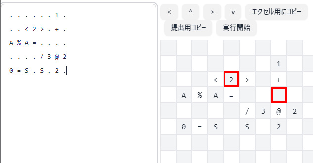

# Team Spica / ICFP Programming Contest 2024

## Members

- [@chiro](https://github.com/chiro/)
- [@draftcode](https://github.com/draftcode/)
- [@fuqinho](https://github.com/fuqinho/)
- [@nya3jp](https://github.com/nya3jp/)
- [@ogiekako](https://github.com/ogiekako/)
- [@phoenixstarhiro](https://github.com/phoenixstarhiro/)
- [@shunsakuraba](https://github.com/shunsakuraba/)
- [@tanakh](https://github.com/tanakh/)

## Programming languages

- Rust for most part of our solutions
- Python for small tools
- TypeScript and Python for infrastructure stuff
- Google Spreadsheet for 3d programming.

## Notable work

### General

#### Common ICFP expression library (by everyone)

[./common](./common)

Common code to work with ICFP expressions, such as parsing and evaluating. We did not finish implementing everything in the specification (e.g. call-by-need) because we didn't have strong needs to evaluate ICFP expressions locally.

A related interesting snippet: Rust macro to embed ICFP expressions in Rust code:
[./tanakh/solver/src/bin/lambdaman.rs](./tanakh/solver/src/bin/lambdaman.rs)

#### Interactive communicator (by @nya3jp)

[./communicate](./communicate)

A small program to communicate with the School of the Bound Variable.

Supports the interactive mode (with readline) and the batch mode.

#### ICFP-to-Haskell/Scheme converter (by @tanakh)

[./tanakh/evaluator](./tanakh/evaluator)

I wrote the code in Rust to evaluate the ICFP expression. I also wrote code to convert it to Scheme and Haskell code. This was useful for debugging my own evaluator and understanding the code. I also implemented a simple Rust eDSL to generate ICFP expressions.

#### Scheme-to-ICFP compiler (by @ogiekako)

[./scmcomp](./scmcomp)

To make programming easier, I wrote a compiler that supports a subset of Scheme and outputs ICFP expressions. Some of our best solutions (6,8,9,19,20) are what we manually wrote in Scheme and compiled. See oka/\*.scm for reference.

#### Infrastructure (by @draftcode)

[./frontend](./frontend)
[./backend_py](./backend_py)
[./backend_rs](./backend_rs)

TODO(draftcode): Describe this

### Lambdaman

#### Random walk solution generator (by @nya3jp)

[./nya/randomman](./nya/randomman)

We used random walk for many problems (4, 5, 7, 10, 11, 12, 13, 14, 15, 17, 18,
21). For each program, we searched for a random seed that collects all pills in
1,000,000 moves. Essentially this is the ICFP program we used in all problems:

```
(fix (fn f s ->
  (if (== s END_SEED) {
    "solve lambdamanXX "
  } else {
    (concat
      (f (% (* s 48271) 18446744073709551557))
      (take 2 (drop (* (/ s 4611686018427387904) 2) "LLUUDDRR")))
  })
) START_SEED)
```

### Spaceship

#### chun's solvers (by @shunsakuraba)

[./chun](./chun)

I created an input pre-ordering utility [spaceship_order](chun/spaceship_order), a solver [spaceship_lasolver](chun/spaceship_lasolver), and one big solver-utility-set [spaceship_analytical](chun/spaceship_analytical).

`spaceship_order` reorders input so that the points are visited by the spaceship in this order. It is mostly greedy order, but the simulated annealing was also used depending on the map.

`spaceship_lasolver` tries to visit the target in pre-sorted order with a A\*-like heuristic search. It tries to "look-ahead" one target; suppose the ship is at `p0` with `v0` and tries to visit `p1` then `p2`. The program searches the fastest route to `p2` via `p1`, then use only the path between `p0` and `p1` (trash `p1` to `p2` path), then

`spaceship_analytical` implements several utility as well as optimizer for the already generated keypad sequence. First it converts the keypad sequence to the vector of `(point, velocity)`. Then the program tries to locally optimize the sequence. There are three optimizers inside. (1) 3-pt optimizer, take `p0-p1-p2` visited in this order, then change `v1` preserving `v0` and `v2`. (2) 4-pt optimizer. (3) swap optimizer, take `p0-p1-p2-p3` and try `p0-p1-p2-p3` visiting sequence.

#### tanakh's solver (by @tanakh)

[./tanakh/spaceship](./tanakh/spaceship)

I implemented an algorithm that greedily selects the next point that can be reached in the shortest time based on the current position and current speed, but the performance was not very good. I also tried an annealing method that solves the order of the points as TSP and then calculates the route, but it did not work well in the case of many points.

#### fuqinho's solver (by @fuqinho)

[./fuqinho/fuqinho-spaceship](./fuqinho/fuqinho-spaceship)

1. Determine visiting order using simulated annealing. (score is total traveling distance)
2. Precompute minimum steps to move dx with initial velocity v0 and terminal velocity v1.
   - -100 <= v0, v1 <= 100, -10000 <= dx <= 10000
3. In 2-dimension movement, calculate the lower bound of steps using above data and search the minimum steps by incrementing target steps.
4. Using the data above, efficiently list up several possible paths from point 1 to point 2.
5. Find paths to visit all given points using beam search. (We keep best 1000 routes at each visited point)

### 3D

#### 3D interpreter (by @chir)

[./chir/interpreter](./chir/interpreter)

We implemented an interpreter for the 3D course in Rust. It implements all noted features and also has the labeling mechanism for easier development.
For example, the interpreter can run the following program:

```
. A     here . .
. v     .    . .
. .     .    . .
. @here .    . .
. .1    .    . .
```

The interpreter automatically fills the jump location for the time warp operator by looking up the label name, 'here'.

The interpreter also provides a mode to convert a program with labels into a program which can be submitted to the server.

#### 3D editor (by @draftcode)

We implemented a Web-based editor for the 3D language. It utilizes the interpreter described above via PyO3.



### Efficiency

- Problem 7, 8

This problem is a bit-encoded SAT sufficiency problem. Since we needed to find the minimum in lexicographic order among those satisfying the conditions, we used z3, a powerful solver, to find the minimum solution in lexicographic order by adding terms to see if the conditions can be satisfied by false, starting with the variables in the upper digits.

- Problem 9, 10, 11

This problem is to find the dictionary-ordered minimum solution of Sudoku encoded in decimal. z3, a powerful solver, was used for this problem as well, since, contrary to the name Efficiency, it is obvious that if the program is run properly, the program will not end even at the end of the universe z3. The answer can be obtained by solving iteratively, starting from the upper digits and adding the condition of using the smallest one that satisfies the constraints.

- Problem 12

This was also a program that could not be executed in a decent amount of time, so we read the contents, made a memo and rewrote it into an equivalent, faster program to find a solution.

- All other problems

They are simple enough to be interpreted by human (Mersenne prime, Fibonacci prime, etc.). We calculated the answer by hand or a simple script.
